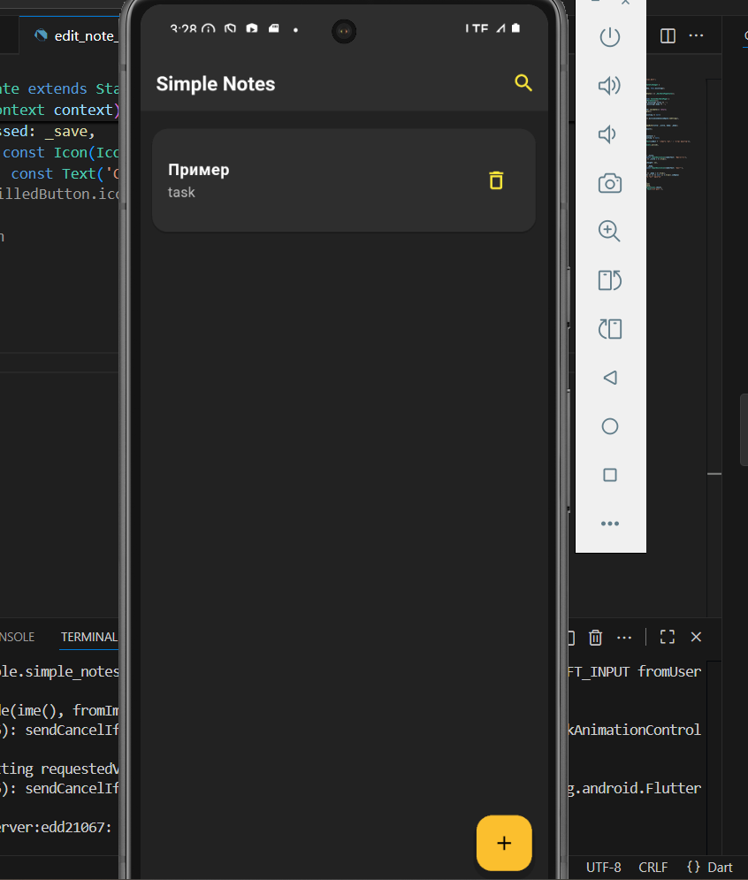
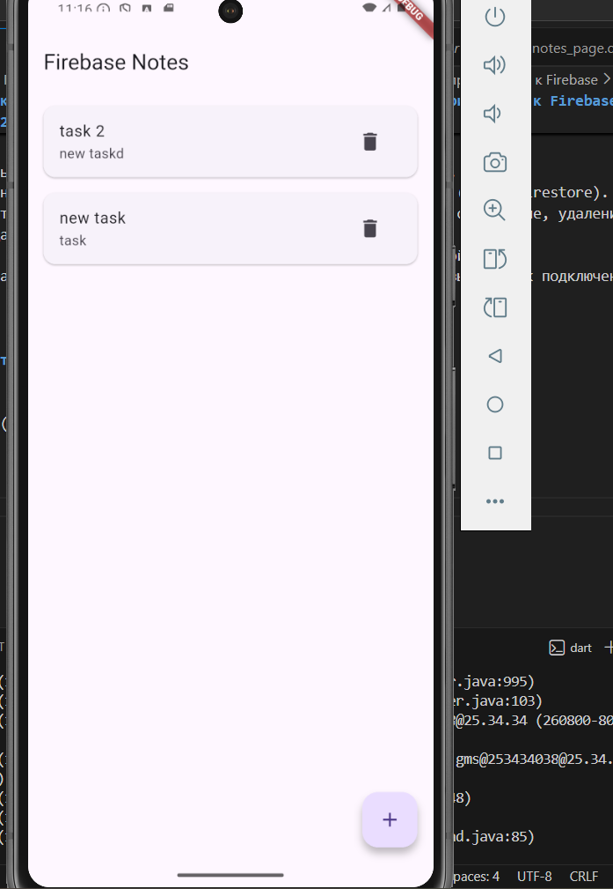
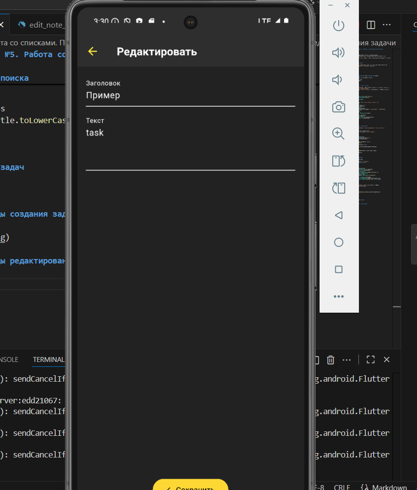
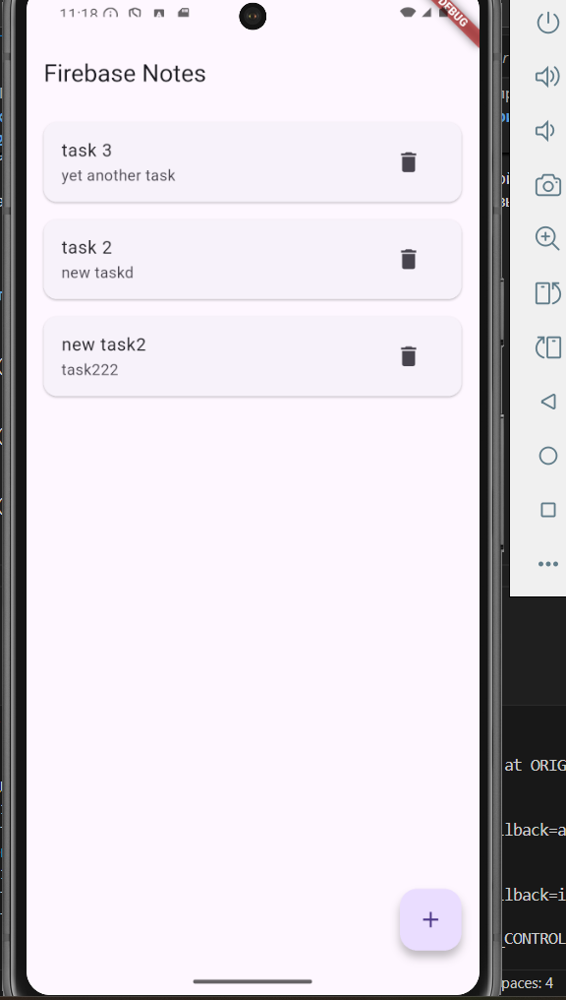
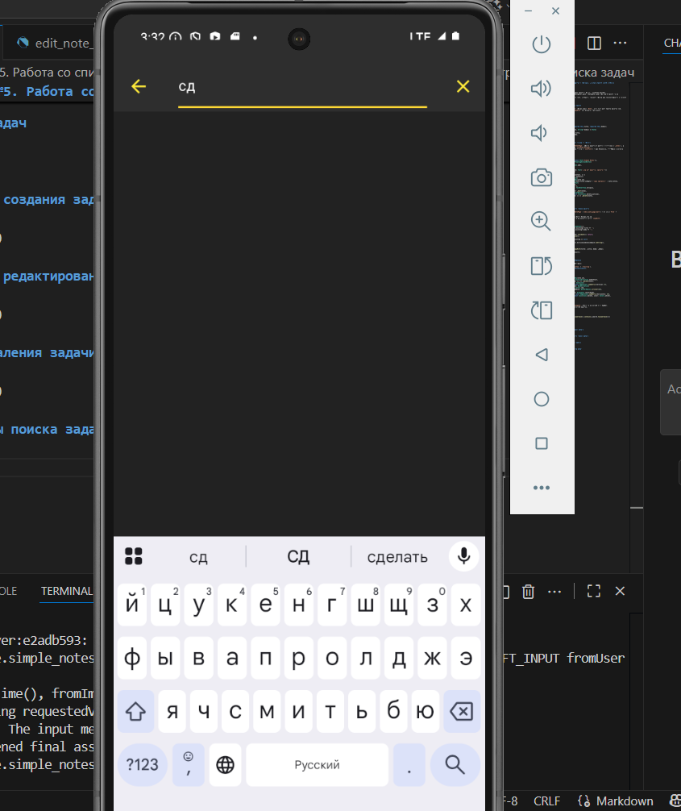
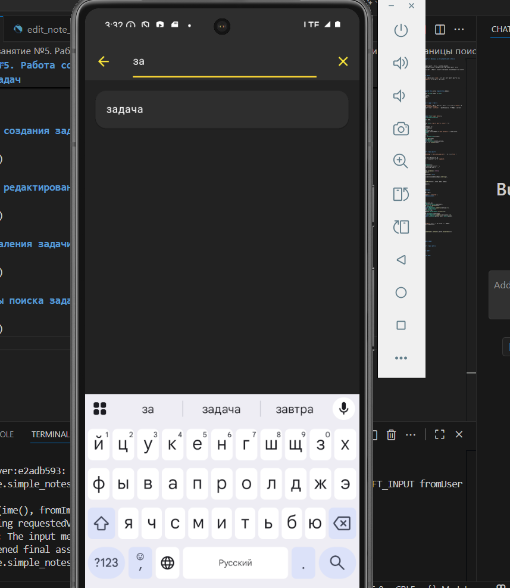

# Практическое занятие №5. Работа со списками. Передача данных между модулями

## ЭФБО-09-23 Мусагитов Марат
_Цели:_

- Научиться отображать коллекции данных с помощью ListView.builder.
- Освоить базовую навигацию Navigator.push / Navigator.pop и передачу данных через конструктор.
- Научиться добавлять, редактировать и удалять элементы списка без внешних пакетов и сложных архитектур.

## Ход работы

### Шаг 1. Определение модели данных

В файле `lib/models/note.dart` описан класс `Note`, который хранит данные заметки (id, заголовок, текст) и метод `copyWith` для удобного обновления.

**Фрагмент кода:**

```dart
class Note {
  final String id;
  String title;
  String body;

  Note({required this.id, required this.title, required this.body});

  Note copyWith({String? title, String? body}) => Note(
        id: id,
        title: title ?? this.title,
        body: body ?? this.body,
      );
}
```

### Шаг 2. Реализация главного экрана со списком

В `main.dart` создан экран `NotesPage`. Список заметок хранится в состоянии (`_notes`), а отображение реализовано через `ListView.builder`.
Каждая заметка представлена карточкой ( `ListTile`) с закруглениями, отступами и иконкой удаления.

**Фрагмент кода:**

```dart
return Scaffold(
      appBar: AppBar(title: const Text('Simple Notes')),
      floatingActionButton: FloatingActionButton(
        onPressed: _addNote,
        child: const Icon(Icons.add),
      ),
      body: _notes.isEmpty
          ? const Center(child: Text('Пока нет заметок. Нажмите +'))
          : ListView.builder(
itemCount: _notes.length,
              itemBuilder: (context, i) {
                final note = _notes[i];
                return ListTile(
                  key: ValueKey(note.id),
                  title: Text(note.title.isEmpty ? '(без названия)' : note.title),
                  subtitle: Text(
                    note.body,
                    maxLines: 1,
                    overflow: TextOverflow.ellipsis,
                  ),
                  onTap: () => _edit(note),
                  trailing: IconButton(
                    icon: const Icon(Icons.delete_outline),
                    onPressed: () => _delete(note),
                  ),
                );
              },
            ),
    );
```

### Шаг 3. Добавление и редактирование заметок

Создан отдельный экран `EditNotePage` (`edit_note_page.dart`) с формой (`Form` + `TextFormField`).

- Если заметка новая → генерируется уникальный id.
- Если заметка уже существует → применяется метод `copyWith`.

**Фрагмент кода:**

```dart
final _formKey = GlobalKey<FormState>();
  late String _title = widget.existing?.title ?? '';
  late String _body = widget.existing?.body ?? '';

  void _save() {
    if (!_formKey.currentState!.validate()) return;
    _formKey.currentState!.save();

    final result = (widget.existing == null)
        ? Note(
            id: DateTime.now().millisecondsSinceEpoch.toString(),
            title: _title,
            body: _body,
          )
        : widget.existing!.copyWith(title: _title, body: _body);

    Navigator.pop(context, result);
  }

```

### Шаг 4. Удаление и свайп-удаление

Удаление реализовано двумя способами:

1. Кнопка с корзиной (`IconButton` в `trailing`).
2. Свайп по элементу через **Dismissible**.

**Фрагмент кода:**

```dart
return Dismissible(
                  key: ValueKey(note.id),
                  direction: DismissDirection.endToStart,
                  onDismissed: (_) => _delete(note),
                  background: Container(
                    margin: const EdgeInsets.symmetric(vertical: 6),
                    decoration: BoxDecoration(
                      color: Colors.red,
                      borderRadius: BorderRadius.circular(16),
                    ),
                    alignment: Alignment.centerRight,
                    padding: const EdgeInsets.symmetric(horizontal: 16),
                    child: const Icon(Icons.delete, color: Colors.white),
                  )),
```

### Шаг 5. Реализация поиска

Для поиска добавлен `SearchDelegate`. Вызов через иконку 🔍 в AppBar.
Фильтрация выполняется по заголовку заметки.

**Фрагмент кода:**

```dart
final filtered = _notes
    .where((n) => n.title.toLowerCase().contains(_search.toLowerCase()))
    .toList();
```

## 1. Скриншот списка задач

 

## 2. Скриншот страницы создания задачи



## 3. Скриншот страницы редактирования задачи



## 4. Скриншот после удаления задачи



## 5. Скриншоты страницы поиска задач

 

