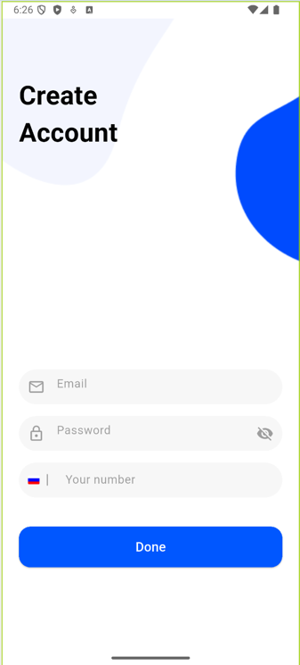
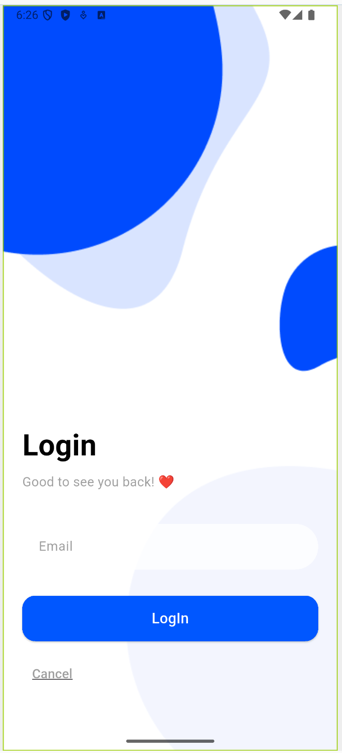
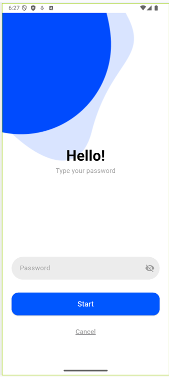
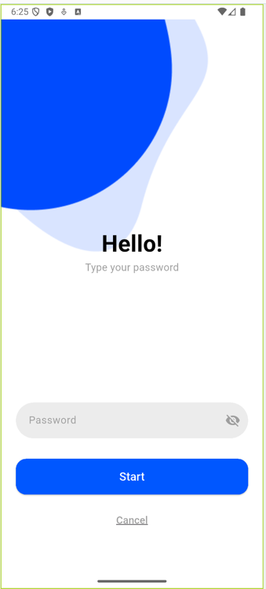
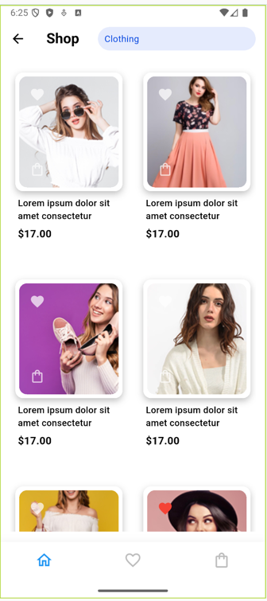
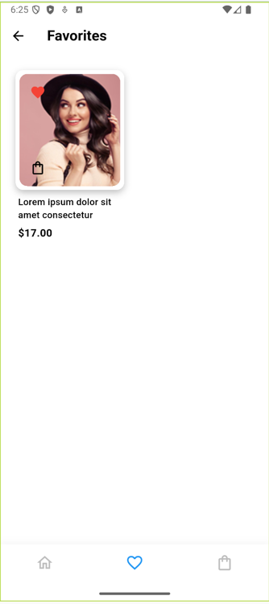
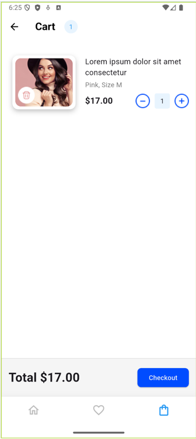
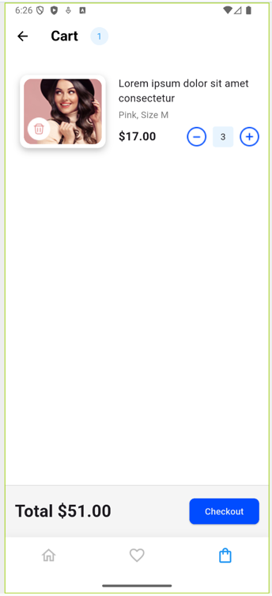

# UI/UX дизайн. Верстка приложения по готовому дизайну (Figma → Flutter).
# ЭФБО 09-23. Мусагитов Марат

## Описание реализованных экранов
Сверстано 7 экранов в соответствии с макетом Figma:
-	Splash Screen — начальный экран загрузки с анимацией (реализован через Image.asset и таймер).
-	Create Account Screen — регистрация с полями Email, Password и номера телефона.
-	Login Screen и Password Screen — разделенные экраны входа (логин → пароль).
-	Shop Screen — главный экран с GridView.builder для отображения 6 товаров. Каждая карточка содержит: изображение товара (ClipRRect + Image.asset), кнопки «Добавить в избранное» и «В корзину» (IconButton с иконками), цену и название товара
-	Favorites Screen — аналог главного экрана, но с фильтрацией товаров по статусу «в избранном».
-	Cart Screen — корзина с детализацией: Счетчик уникальных товаров в шапке, карточки с возможностью изменения количества (+/-), автоматический пересчет итоговой суммы при изменении quantity.
Навигация реализована через:
-	BottomNavigationBar (3 пункта: главная, избранное, корзина)
-	Navigator.pushNamed для переходов между аутентификационными экранами.

Удачные UI/UX решения:
- Единая цветовая схема: Синий (#0057FF) как акцентный цвет для кнопок и иконок создает целостность.
- Интуитивная навигация: BottomNavigationBar с иконками вместо текста упрощает взаимодействие (соответствует Material Design).
- Динамические карточки товаров: Использование GridView.builder обеспечивает плавную прокрутку даже при большом количестве товаров.
Требует доработки - Экран аутентификации: нет валидации полей и отсутствует анимация переходов между экранами входа/пароля.

Заключение:
- Проект успешно реализован в соответствии с ТЗ:
- Все экраны сверстаны и соответствуют макету Figma.
- Навигация работает корректно (проверено на эмуляторе Pixel 7).
- Цвета и шрифты соответствуют UI-макету

